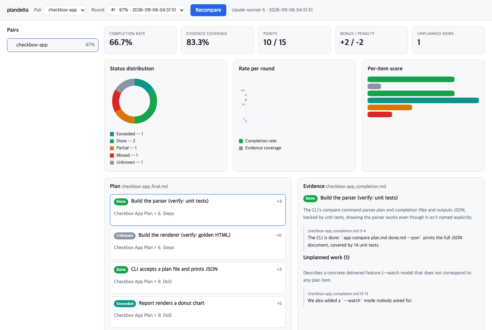

# plandelta

[](https://github.com/oh-namgyu/plandelta/actions/workflows/ci.yml)
[](LICENSE)

> **한글 요약**
>
> 계획서와 완료 보고서를 **항목 단위로 대조**해서, 지킨 것 · 부분만 한 것 ·
> 못 지킨 것 · 계획에 없던 추가분을 **근거 문장 인용과 함께** 판정하고 HTML
> 리포트로 보여줍니다. 문서가 바뀌면 **바뀐 항목만** 다시 판정하므로 재실행이
> 사실상 공짜입니다. 표준 라이브러리만 쓰고 필수 의존성이 없으며, 판정은
> `claude` CLI(기본, API 키 불필요) · Anthropic API · OpenAI 호환 엔드포인트
> (LM Studio 같은 로컬 모델 포함) 중에서 고를 수 있습니다.
> **중요**: `claude` CLI 는 로컬에서 실행되지만 문서 본문은 외부로 전송됩니다.
> 그래서 외부 엔진은 전부 `--yes-send-external` 동의를 한 번 받아야 동작합니다.

Compare a plan document against what actually shipped, with cited evidence.

```bash
python3 -m plandelta pairs --root docs/plans
python3 -m plandelta compare my-project --root docs/plans \
    --yes-send-external --report out/
```



## Why

A plan and its completion report are usually both true and rarely comparable.
The plan promises eight things in the language of intent; the report describes
what happened in the language of work done. Six months later nobody can say
which promises were kept without reading both documents side by side and
holding the mapping in their head.

Requirements-traceability tools solve this by asking you to restructure first:
give every requirement an ID, maintain trace links, keep the matrix honest.
That works when the discipline exists. plandelta assumes it does not — that
what you have is two Markdown files written by humans in a hurry — and does the
matching itself, showing the quote it based each verdict on so you can disagree
with it.

## What a verdict looks like

```text
● exceeded  +5   Report renders a donut chart
                 "the report renders a donut chart and, beyond the plan, also
                  renders a sparkline trend that was not requested"
◐ partial   +1   Export is streamed
○ missed    −2   Load test sustains 1k requests per second
                 "load testing only reached 300 requests per second"
? unknown    0   Build the renderer        (no evidence found — not a broken promise)
+ unplanned  0   "We also added a --watch mode nobody asked for."
```

`unknown` is the status that makes the rest trustworthy. plandelta abstains
rather than guesses, and it does so under two rules:

- **A claim needs evidence.** `done` and `exceeded` require a quote that occurs
  verbatim in the completion documents. An unverifiable quote is dropped, and a
  claim left without one becomes `unknown`.
- **A shortfall needs to be stated.** `partial` and `missed` require a quote
  that *says* the unmet part — deferred, dropped, reduced, or short of a stated
  number. Silence about part of an item is not a shortfall, so it abstains
  instead of reading as a broken promise.

The report shows **evidence coverage** next to the completion rate, so a
confident-looking number is never read out of context: 90% completion at 40%
coverage means the tool judged very little, not that the work went well.

## Install

```bash
git clone https://github.com/oh-namgyu/plandelta && cd plandelta
python3 -m plandelta --help          # no install step, no dependencies
pip install -e .                     # optional, for the `plandelta` command
```

Requires Python 3.9+. The default engine needs the
[`claude` CLI](https://claude.com/claude-code) on your `PATH`.

## Usage

### Find the pairs

```bash
python3 -m plandelta pairs --root docs/plans --json
```

A pair is one plan document plus the completion documents that answer it.
Either write `plandelta.pairs.json`:

```json
[{"id": "checkout-v2", "plan": "checkout-v2_final.md",
  "done": ["checkout-v2_completion.md", "checkout-v2_verify.md"]}]
```

…or let the default globs do it: `<slug>_final.md` (falling back to
`<slug>_draft.md`) pairs with `<slug>_completion.md`. A plan with no completion
document is skipped with a reason rather than silently dropped.

Only documents that *report what was delivered* are in a bundle by default. That
rule was learned the hard way: an earlier version also pulled in `_verify.md`,
which in the author's corpus is a pre-implementation review of the plan, and the
judge read "the rollback procedure is undefined" — a complaint about the plan —
as proof that rollback never shipped. If your review notes do describe delivery,
add them explicitly through the manifest.

### Compare

```bash
python3 -m plandelta compare --root docs/plans --report out/ --json
```

| Flag | Meaning |
|---|---|
| `--engine` | `claude-cli` (default), `anthropic-api`, `openai-compatible` |
| `--model` | Pin the model. A reply from a different model is rejected |
| `--base-url` | Endpoint for `openai-compatible` (e.g. `http://localhost:1234/v1`) |
| `--force` | Re-judge everything, ignoring the cache |
| `--report DIR` | Write a standalone HTML report per pair |
| `--yes-send-external` | Consent to sending document text off the machine |

### Review it in a browser

```bash
python3 -m plandelta serve --root docs/plans --yes-send-external
# plandelta UI: http://127.0.0.1:6188/?token=…
```

One page: the pair list with a dot on anything that drifted since its last
comparison, the KPI row, three charts (status donut, completion rate per round,
per-item score), and a plan/evidence split where clicking a promise shows the
quotes the verdict rests on.

The URL carries a session token minted at startup, and the server refuses
requests without it. It also checks the `Host` header (so a page you visit
cannot reach this port by DNS rebinding) and the `Origin` on anything that
writes — recompare is a write, because it can send your documents to an external
engine. It binds loopback unless you pass `--host`, which prints a warning.

### Track it over time

```bash
python3 -m plandelta snapshots checkout-v2 --root docs/plans
python3 -m plandelta snapshots checkout-v2 --root docs/plans --backup
```

Each comparison with changed documents appends a snapshot, so the completion
rate becomes a series rather than a single reading. Items are tracked across
revisions by a stable key, and a renamed item keeps its history instead of
appearing as a deletion plus an addition.

## Re-running is cheap

A verdict is cached against a fingerprint of everything that could change it:
the item text, the retrieved evidence *and its wording*, the prompt version,
the algorithm versions, and the engine and model.

That cache is also where reproducibility comes from. The HTTP engines are called
with `temperature: 0`, but the `claude` CLI exposes no such flag, so two fresh
runs of the default engine can disagree on a borderline item. What plandelta
guarantees is narrower and more useful: **the same inputs return the same stored
verdict**, and a changed input is re-judged rather than papered over. In practice:

- documents unchanged → no snapshot, no model call, sub-second exit;
- one line edited in a completion report → only the items whose evidence moved
  are re-judged, everything else is served from cache;
- switching model or upgrading plandelta → the fingerprint changes, so stale
  verdicts are not silently reused.

## Scoring

| Status | Points | In the rate? |
|---|---|---|
| `exceeded` | +5 | yes |
| `done` | +3 | yes |
| `partial` | +1 | yes |
| `missed` | −2 | yes |
| `extra` | 0 | counted separately as scope creep |
| `unknown` | 0 | no — counted as missing coverage |
| `error` | 0 | no |

Completion rate is `points / (scored items × 3)`, clamped to 0–100%. The bonus
from `exceeded` items and the penalty from `missed` items are reported
separately so neither can hide inside one percentage.

## Limits

- Markdown only. No Notion, Jira or Confluence connectors.
- Items are extracted with rules (checkboxes, ordered lists, then headings for
  prose plans). Editing the extracted items by hand is not supported yet.
- Overriding a verdict by hand is not supported yet; `unknown` items are
  surfaced for a human to read, not corrected in place.
- `extra` (unplanned work) detection is unstable run to run — treat it as a hint,
  not a metric.

## Security

Document text leaves your machine with every engine except a `localhost`
`openai-compatible` endpoint — including the default `claude` CLI, which runs
locally but talks to Anthropic. See [SECURITY.md](SECURITY.md) for the data
paths, the untrusted-input handling (prompt injection, fabricated quotes, XSS,
path traversal) and the subprocess hardening.

## License

MIT — see [LICENSE](LICENSE). Security policy: [SECURITY.md](SECURITY.md).
